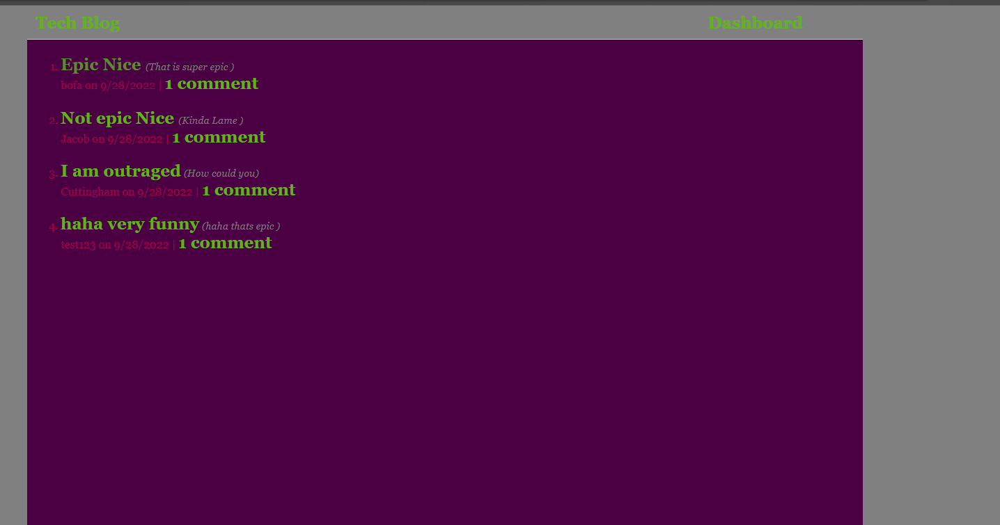

# Tech Blog

## Description
This is a tech blog coded in javascript and making use of handlebars in order to format and display the pages. It demonstrates functionality in creating a user, logging in a user, creating a post, commenting on a post, and deleting a post.

## Installation
Simply clone the repo on your local machine, download the npm packages, and create a .env file with your root username and password.

## Usage
You will need to create an account, and afterwards you are free to make a post, look at some premade posts, or delete your posts.

## Github Repo

https://github.com/Cuttingham/tech_blog

## Screenshot

## Questions
If you have any questions feel free to reach out to me at wowcuttingham@gmail.com 